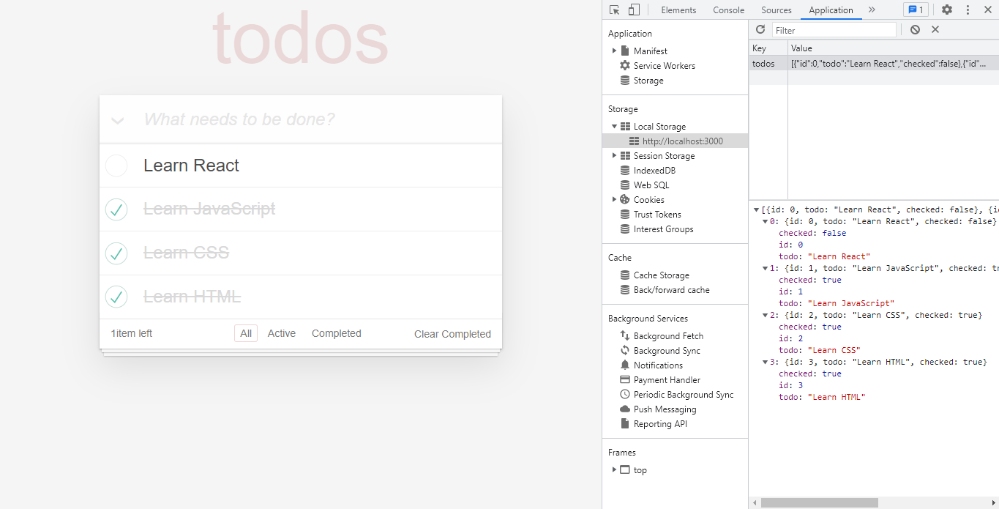

# Todo App

[Kodluyoruz](https://www.kodluyoruz.org/)  Front-End eğitimi için hazırlanan 'Orta Seviye Front-End Web Development Patikası' ödevidir. React "Ödev 2" için oluşturulmuştur.

Proje linki: https://todo-app-cancelik.netlify.app/

## Todo App

- [Projenin canlı hali için tıklayın.](https://todo-app-cancelik.netlify.app/)

- Proje Görseli;

### [Patika.dev Profilim](https://app.patika.dev/canncelik)
### [Hacker Rank Profilim](https://www.hackerrank.com/ogulcan_celik24)
#### [www.patika.dev](https://app.patika.dev/)